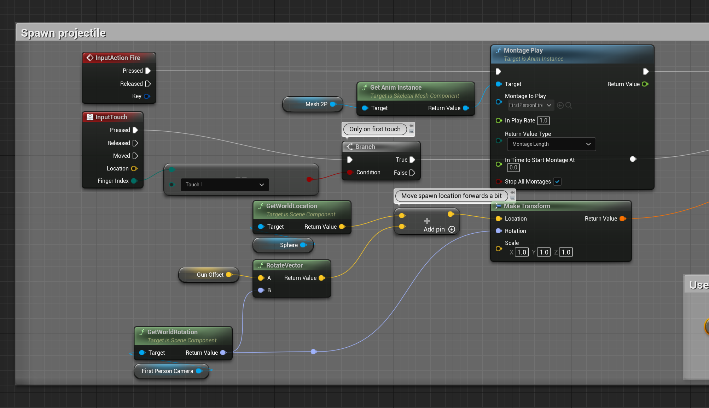
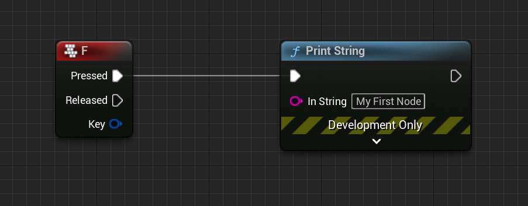
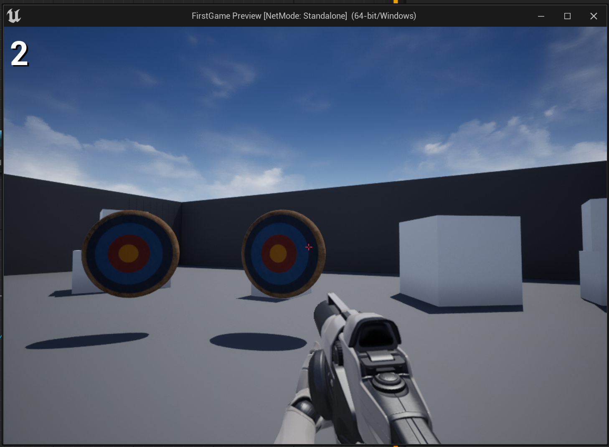
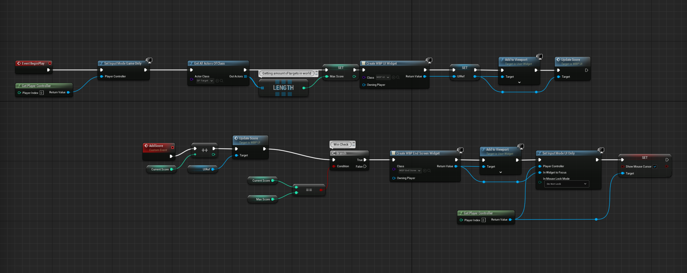
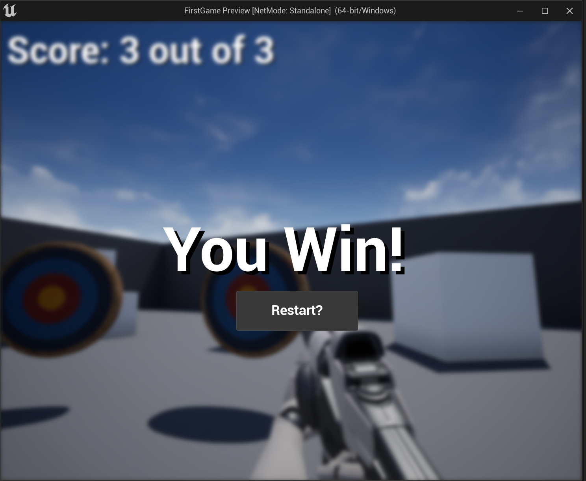

# Hack Technology / Project Attempted

Unreal Engine 5

## What you built? 

I followed a tutorial that teaches the basics of Unreal Engine 5!

## Who Did What?

I did everything!

## What you learned

1. How to use the UE5 Interface.
2. How to use templates for setting up different types of games.
3. How to work with UE5's Blueprint, which is a UI version for scripting using nodes and links/arrows!
4. How to manipulate nodes and create custom event nodes.
5. How to create, access, and manipulate variables in Blueprint.

It was really great learning UE5! I think it's a little difficult to learn the Blueprint UI in the beginning but after spending a lot of time, it gets a lot easier and can even be a better alternative to traditional code-writing! The tutorial was fairly straightforward and I didn't have too many issues -- would definitely recommend the tutorial for anyone trying to learn UE5. I also think the UE5 interface is slightly better than Unity's because it gives more freedom of movement and allows developers to move around the scene almost effortlessly. The graphics are also INSANE -- the only downpart is that downloading UE5 is over 100gb, and that's not even including their Quixel Bridge, which is a massive online assets library filled with so many models, materials, textures, and more. Ultimately, would definitely recommend learning!

## Authors

Julian Wu

## Acknowledgments

1. __UE5 Lag Fixes:__ https://www.youtube.com/watch?v=esrnQBq75qg&ab_channel=BuvesaGameDevelopment
2. __Game Tutorial:__ https://www.youtube.com/watch?v=ITCWa3oLNAQ&ab_channel=UnrealSensei
